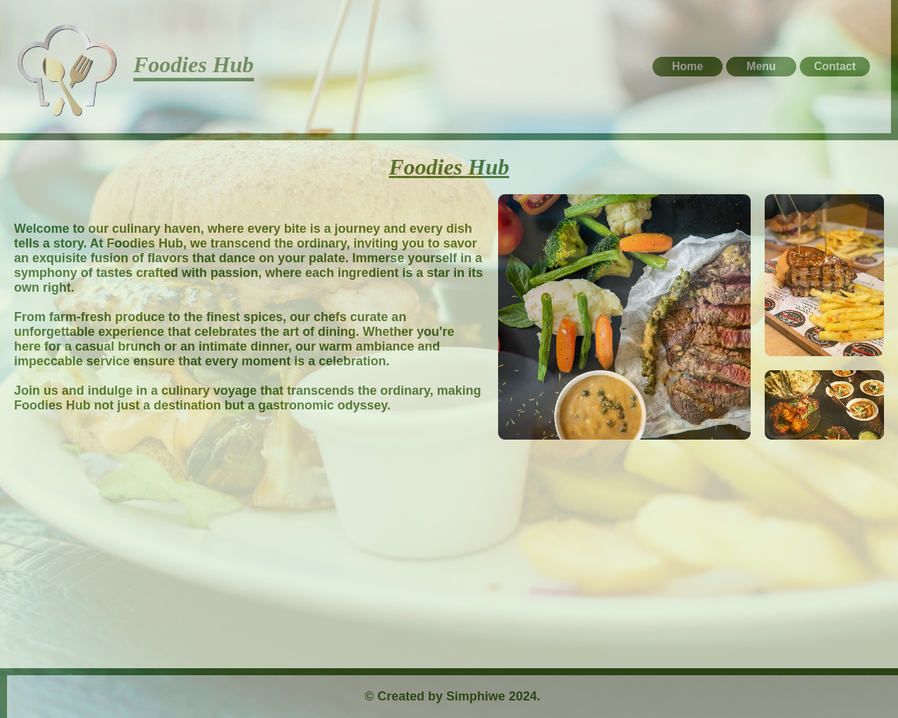

# **Restaurant Page**

Check it _**LIVE**_ 👉
**<https://deebest.github.io/restaurant-page/>**

This is a multi page restaurant website, it is a project I built for the Odin project curriculum where I am learning the full stack web development.

## Features

- The website has multiple pages, a home page, menu page and contact page.
- It's design is responsive suitable for any devices
- Consist of a feedback form on the contact page

## Tech stack used

- GIT
- HTML
- CSS
- JavaScript
- NPM
- Webpack

## Contact

Get in touch:

Email : **<simphiwedladla8@gmail.com>**

Linked: **<https://www.linkedin.com/in/dladla-simphiwe-89061a20a/>**

Github: **<https://github.com/DeeBest>**
